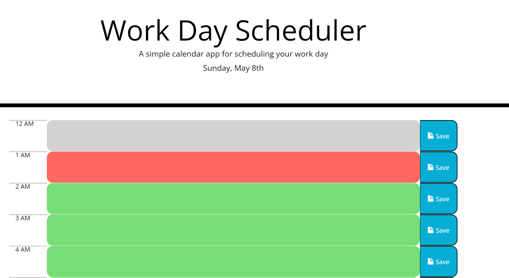
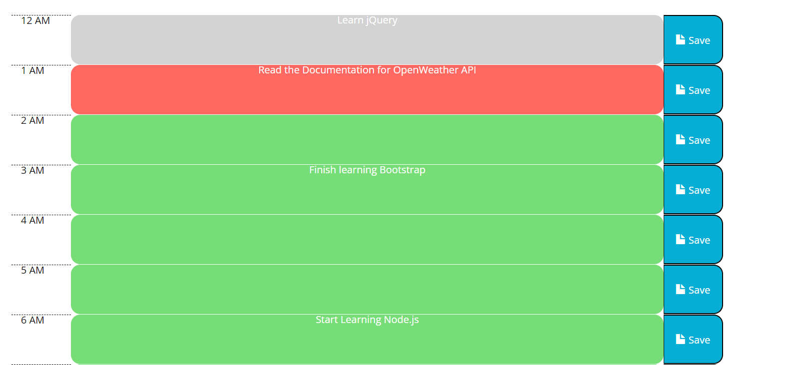

# Work Day Scheduler
Click [here](https://ancosta993.github.io/work-day-schedular/) for the deployed project.

## Introduction
This application keeps track of events assigned to each of the 24 hours of the current day to help the user manage time effectively. The project was coded with HTML, CSS Bootstrap, and jQuery and moment.js for JavaScript. 

## Function
- When the user opens the application, current date and day is displayed in the jumbotron.
- User is presented with time blocks representing one hour.
- At the left end, there is a small block noting the hour of the block; at the right end, there is a small block for save button.
- Blocks are color coded:
  - Gray blocks represent past hours.
  - Red block represent current hour.
  - Green blocks represent future hour.
- Clicking on each block allows the user to enter text in the block.
- The text can be saved by clicking the save button shown at the end of each block.
- The text can be edited by re-clicking the same time block and saving it.
- All the data are stored in the browser storage.
- Refreshing the page loads the past data (events set in the time blocks).

## Site Structure
The overall structure of the site does not change. Ony the text content within the blocks can change. The structure is divided in two parts: Jumbotron and Main Content.
- Jumbotron
 - Name of the Page and simple discription
 - Current date and day.
- Main Content
 - Further divided into three parts:
   - Gray blocks
   - Red block
   - Green blocks
  
## Logic (PseudoCode)
- The data on top of the page is displayed with `moment().format('dddd, MMMM Do)` and appended to the jumbotron.
- An array is initiated with data from local storge. This array will keep track of data object for event lists.

Primary functions that are not specific to any event handler are `auditBlockColor()`, `storeData()` `loadData()`.

### Changing the color of the blocks
- `auditClockColor()` function completes this task. 
- It checks for current hour and formats it using `moment().format('HH')`. It is referenced by the var `currentHour`.
- A for loop is then use to iterate over all the elements with `class = '.row'`. Each of them also have an `id` of their assinged time.
 - On each iteration: difference between current time and the time of the block (from it's id) is checked.
 - Conditional statements are then used to change the color of the blocks.
 - It uses `$(this)` object methods to identify the current element.
 - This function is run every 1 hour.

### Storing Data
- This function mainly stores the current array with all the data in the local storage.

### Load Data.
- Takes the data from the local storage in JSON format.
- If there is no data, then initiate an empty array to store further data.
- If there is data, loop through the data:
  - use the id and class to identify the time blocks. 
  - Change the text content of the blocks with value from the data.
  
### Event Listeners
There are three main event listeners and handlers.
- `.container` class with click and blur listener.
- event propagation is used to make the event work from the elements with 'time-block` class.
- `.saveBtn` with click listener.
- When a time-block class element is clicked, the `div` element is changed to `textarea` element, allowing the user to enter texts.
- When any other place is clicked while the time block is active, blur event kicks in.
- The blur event replaces the `textarea` with `div`.
- The entered text can be saved by clicking the `.saveBtn` button which calls the `storeData` function.

## Final Look

